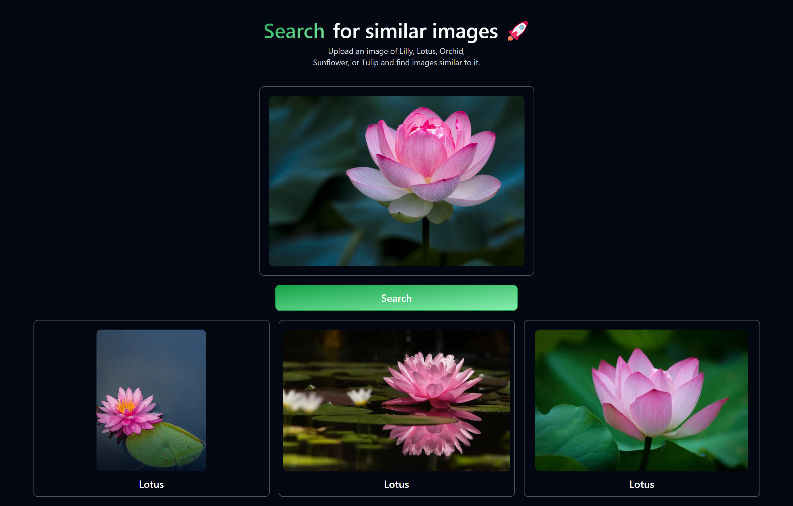

# Neon Image Search

This is an image search app, built using NeonDB and Vertex AI. It uses Vertex AI to convert the data images into embeddings and then stores it into NeonDB. When a request is made the request image is converted into embeddings and then the similarity search is performed by NeonDB using PGVector.




## How it works?

It starts by first converting the data images stored in the `public/flower_images` folder into embeddings. Embeddings are high-dimensional vectors that represent the images in a format that computers can understand and process. This conversion is done using Google Cloud's Vertex AI. Once the images are converted into embeddings, these vectors are stored in NeonDB, it is a database that supports vector search using PGVector extension.

When a user uploads and image and performs similarity search using the app. The following process happens

1. Conversion of request images into embeddings. Now again machine cannot understand the image, the image is processed and converting into vectors.
2. Now once the images are converted into vectors, NeonDB performs a similarity search using its PGVector extension.
3. The similarity search returns a list of images from the database that are most similar to the uploaded image. These results are ranked based on their similarity scores. (The similarity search is performed using cosine distance)
4. The results are then sent back to the UI and are displayed.

## Installation

Before we began with the installation make sure you're logged in, in the [Google Cloud CLI](https://cloud.google.com/docs/authentication/gcloud#gcloud-credentials).

1. Clone the repo

```bash
git clone https://github.com/ItzCrazyKns/Neon-Image-Search.git
```

2. Install dependencies

```bash
yarn
```

Or if you are using NPM

```bash
npm i
```

3. Change the name of `.example.env.local` to `.env.local` and fill all the fields.

4. Convert data images into embeddings. (The data images are stored in `/public/flower_images`)

```bash
yarn run generate-embeddings
```

Or if you are using NPM

```bash
npm run generate-embeddings
```

5. Then finally started the app

```bash
yarn run dev
```

Or if you are using NPM

```bash
npm run dev
```

**Note**: You can build the project then also use it by following NextJS's guidelines.
